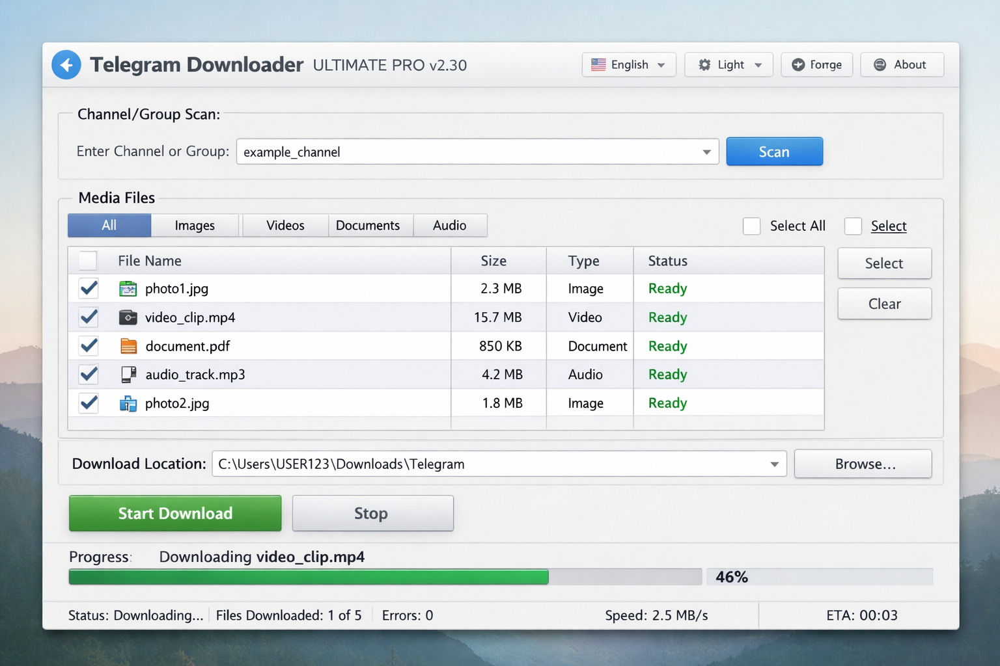

⚡ Telegram Downloader ULTIMATE PRO

Version 2.3.0

The most advanced, high-performance media retrieval engine for Telegram.

🇺🇸 English   ⠂   🇮🇱 עברית

🌍 English

📑 Table of Contents

Overview

Key Features

Technical Stack

Getting Started

Security & Disclaimer

Contributing

🚀 Overview

Telegram Downloader ULTIMATE PRO is a professional-grade desktop application designed for high-speed, bulk media retrieval from Telegram channels and groups. Built with a focus on performance, security, and a premium user experience, it leverages the Telethon API and a custom-built parallel download engine to deliver unparalleled efficiency.

💎 Key Features

🏎️ Parallel Engine: Download up to 3 files simultaneously with optimized resource management.

🔄 Smart Resume: Robust support for continuing interrupted downloads, saving time and data.

🔍 Deep Scan: Advanced scanning algorithms to index media across thousands of messages.

🎨 Premium UI/UX: Modern Material Design interface with full Dark Mode support and smooth transitions.

🌍 Bilingual: Native support for English and Hebrew with real-time language switching.

🛡️ Secure & Local: All session data and media are stored locally on your machine. No cloud storage.

🛠️ Technical Stack

Language: Python 3.10+

GUI Framework: PyQt6 (Modern, responsive desktop interface)

API Engine: Telethon (Asynchronous Telegram API client)

Networking: AsyncIO (High-concurrency operations)

Styling: Custom QSS (Advanced dark/light theme engine)

📦 Getting Started

Prerequisites

Ensure you have Python 3.10+ installed on your system.

Installation

Clone the repository:

git clone [https://github.com/Avielzi/telegram-downloader.git](https://github.com/Avielzi/telegram-downloader.git)
cd telegram-downloader

Setup the environment automatically:

install.bat

Launch the application:

run.bat

🔒 Security & Disclaimer

This tool is developed for educational and personal archiving purposes only. The developers are not responsible for any misuse of this software. Ensure you have the right to download and store the media you are accessing. All Telegram API sessions (*.session) are stored strictly on your local machine.

🤝 Contributing

Contributions, issues, and feature requests are welcome!
Feel free to check the issues page.

🇮🇱 Hebrew

📑 תוכן עניינים

סקירה כללית

תכונות מרכזיות

ארכיטקטורה טכנולוגית

מדריך התקנה והפעלה

אבטחה והבהרה משפטית

תרומה לקוד

🚀 סקירה כללית

Telegram Downloader ULTIMATE PRO היא אפליקציית שולחן עבודה מקצועית שתוכננה להורדה המונית ומהירה של מדיה מערוצים וקבוצות בטלגרם. האפליקציה נבנתה עם דגש על ביצועים, אבטחה וחוויית משתמש יוקרתית, תוך שימוש ב-API של Telethon ומנוע הורדה מקבילי שפותח במיוחד ליעילות מקסימלית.

💎 תכונות מרכזיות

🏎️ מנוע מקבילי: הורדה של עד 3 קבצים בו-זמנית עם ניהול משאבים אופטימלי.

🔄 המשך חכם: תמיכה חזקה בהמשך הורדות שהופסקו, לחיסכון בזמן ובנתונים.

🔍 סריקה עמוקה: אלגוריתמי סריקה מתקדמים לאינדוקס מדיה לאורך אלפי הודעות.

🎨 ממשק פרימיום: ממשק Material Design מודרני עם תמיכה מלאה במצב כהה ומעברים חלקים.

🌍 דו-לשוני: תמיכה מובנית בעברית ובאנגלית עם החלפת שפה בזמן אמת.

🛡️ מאובטח ומקומי: כל נתוני הסשן והמדיה נשמרים מקומית על המחשב שלך בלבד.

🛠️ ארכיטקטורה טכנולוגית

שפה: Python 3.10+

ממשק משתמש: PyQt6 (ממשק דסקטופ מודרני ורספונסיבי)

מנוע API: Telethon (לקוח אסינכרוני ל-API של טלגרם)

תקשורת: AsyncIO (פעולות במקביליות גבוהה)

עיצוב: Custom QSS (מנוע ערכות נושא מתקדם)

📦 מדריך התקנה והפעלה

דרישות קדם

ודא שמותקן אצלך במחשב Python 3.10+.

התקנה

שבט את המאגר:

git clone [https://github.com/Avielzi/telegram-downloader.git](https://github.com/Avielzi/telegram-downloader.git)
cd telegram-downloader

הרץ את סקריפט ההגדרה האוטומטי:

install.bat

הפעל את האפליקציה:

run.bat

🔒 אבטחה והבהרה משפטית

כלי זה פותח למטרות חינוכיות וארכיון אישי בלבד. המפתחים אינם נושאים באחריות לכל שימוש לרעה בתוכנה זו. ודא שיש לך את הזכות להוריד ולשמור את המדיה שאליה אתה ניגש. כל קובצי ההתחברות של טלגרם (*.session) נשמרים אך ורק על המחשב המקומי שלך.

🤝 תרומה לקוד

תרומות, דיווחי תקלות ובקשות לתכונות חדשות יתקבלו בברכה!
מוזמנים לבדוק את עמוד ה-Issues.

📜 License & Copyright

Distributed under the MIT License. See LICENSE for more information.

Copyright © 2026 Aviel.AI. Built with ❤️ for the community.

